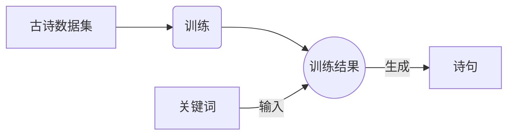
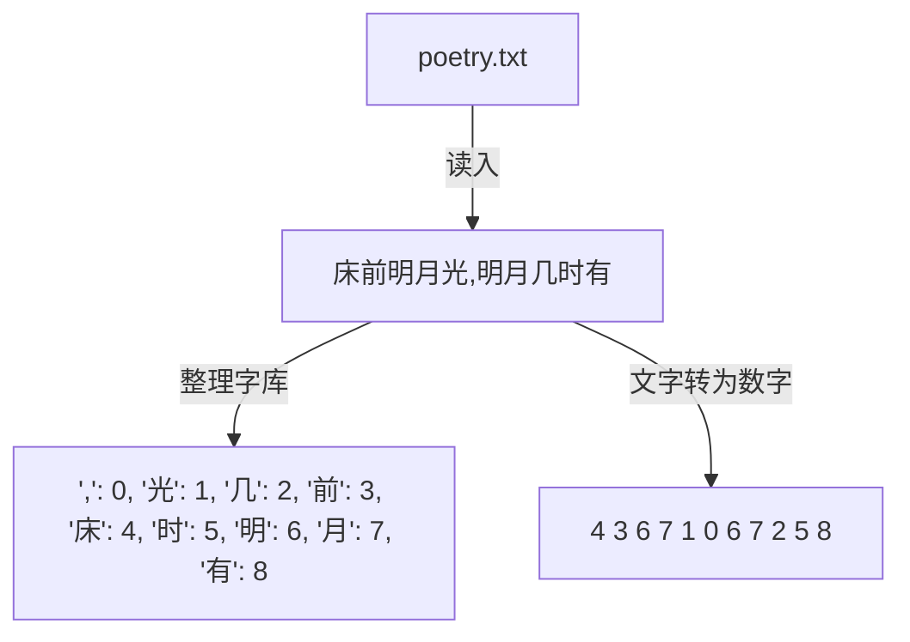
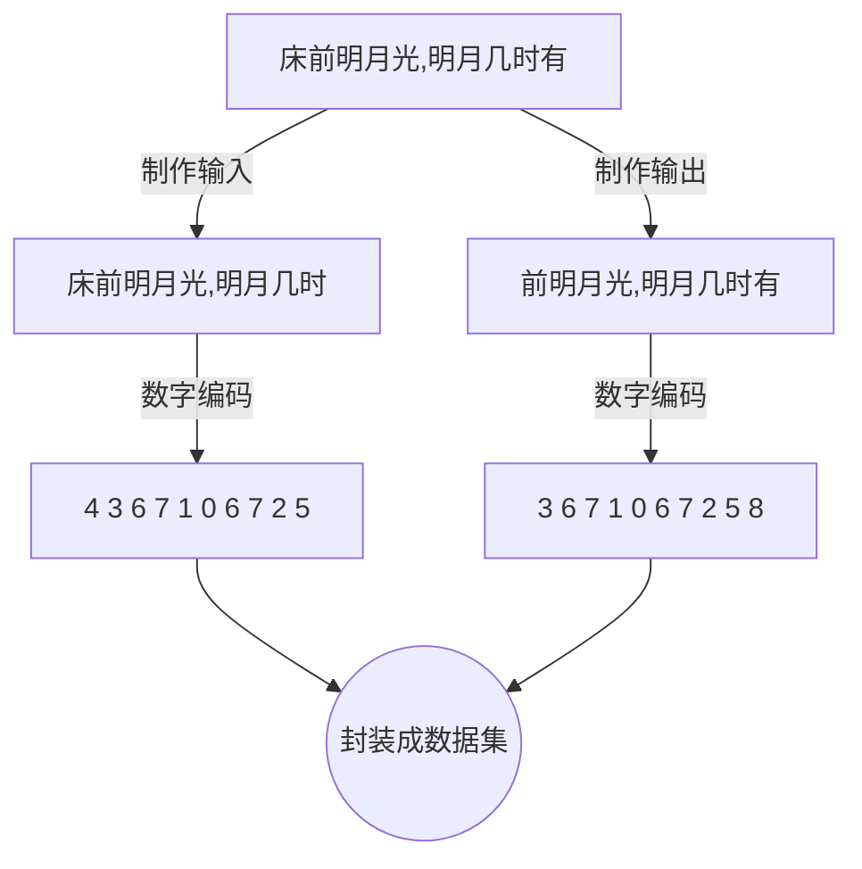
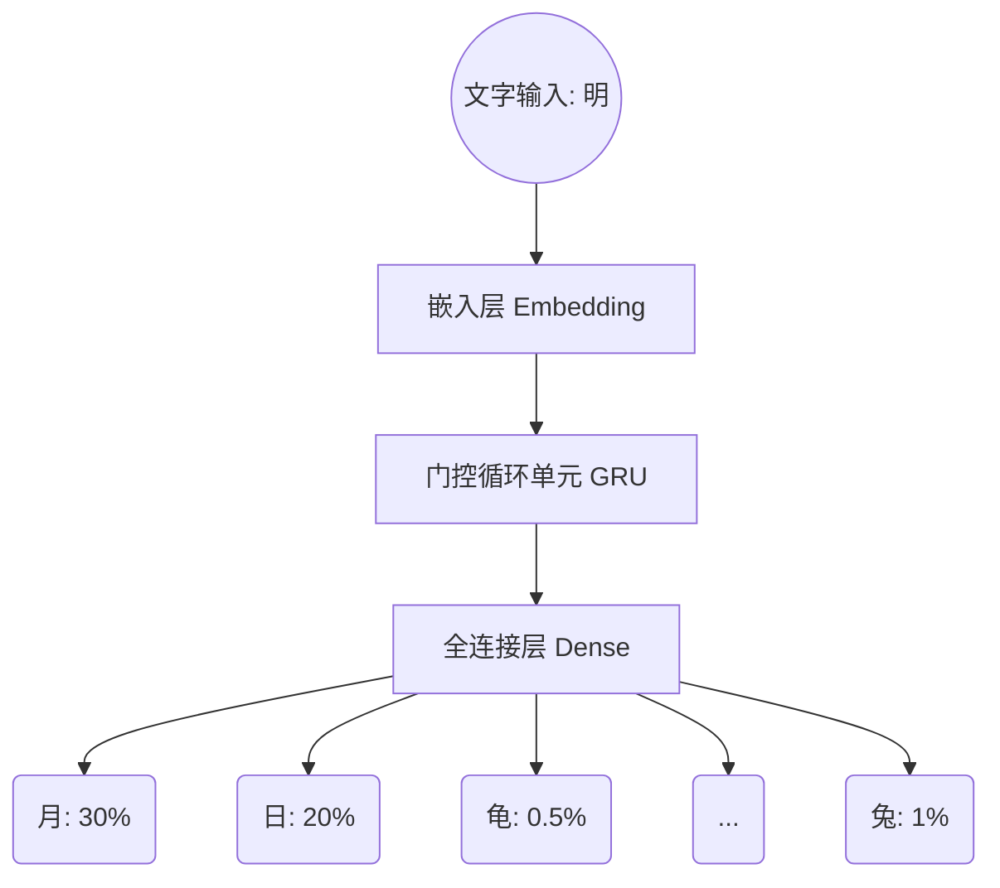
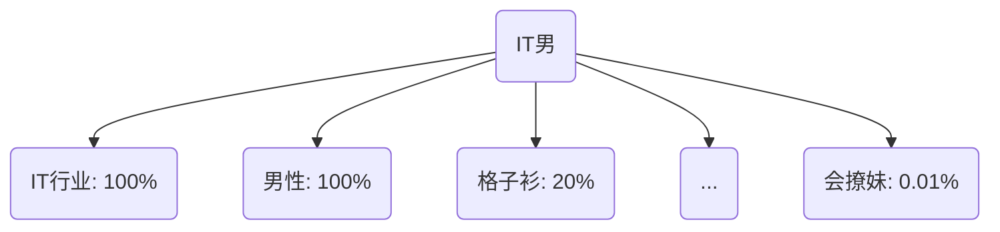
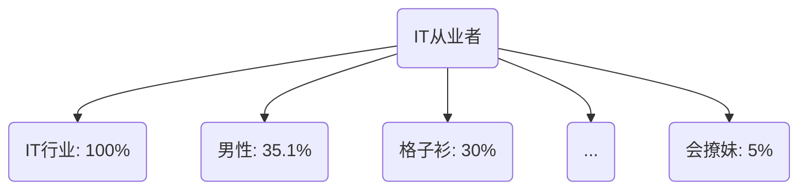
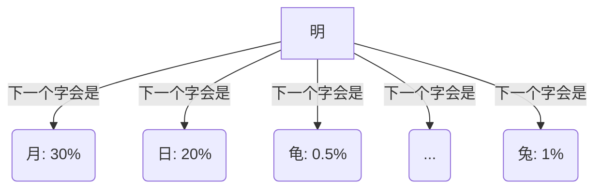

# 一、亮出效果
世界上美好的事物很多，当我们想要表达时，总是感觉文化底蕴不够。

- 看到大海时，心情舒畅，顿时感觉激情澎湃，想了很久，说了句：真大啊！ 
- 看到鸟巢时，心情舒畅，顿时感觉激情澎湃，想了很久，说了句：真大啊！
- 看到美女时，心情舒畅，顿时感觉激情澎湃，想了很久，说了句：真大啊！

是的，没有文化底蕴就是这样。

但是，你生在这个数字时代，中华五千年的文化底蕴，你触手可及！
这篇教程就是让人工智能学习大量的诗句，找到作诗的规律，然后你给他几个关键字，他给你一首诗。

**看效果**：
| 输入的关键词 | 输出的诗句|
|--------| ---------|
| 大海，凉风| 大海阔苍苍，至月空听音。筒动有歌声，凉风起萧索。 |
| 建筑，鸟巢 | 建筑鼓钟催，鸟巢穿梧岸。深语在高荷，栖鸟游何处。 |
| 美女 | 美女步寒泉，归期便不住。日夕登高看，吟轩见有情。 |
| 我，爱，美，女| 我意本悠悠，爱菊花相应。美花酒恐春，女娥踏新妇。 | 
| 老，板，英，明| 老锁索愁春，板阁知吾事。英闽问旧游，明主佳期晚。 | 

# 二、实现步骤
## 基本流程

看上面的图，我们可以了解到，基本上就是两步：**训练**和**使用**。

打铁还得要铁呢，我们训练数据，首先得有数据，我这里的数据是这样的：


> 床前明月光 疑是地上霜 举头望明月 低头思故乡 渌水明秋月 南湖采白蘋 荷花娇欲语   ……

这只是一小部分，总共大约70000句左右，都存在一个txt文档里。

训练总共分为3步：**准备数据**、**构建模型**、**训练并保存**。

## 2.1 准备数据

> 爱情不是你想买，想买就能买。

这句话揭示了世间道理是相通的。因为，训练不是你想训，想训就能训。你得把数据整理成人工智能框架要求的格式，他们很笨，**喜欢数字**，而且TensorFlow就认Tensor（*不要被英文吓到，就是一串数字外面套一层人家的装甲壳子*）。

1. 数据第一次处理

2. 数据第二次处理


### 2.1.1 读取文件内容

```python
import tensorflow as tf
import numpy as np
import os
import time
# 从硬盘或者网络连接读取文件存到的.keras\datasets下，这里是把数据集poetry.txt放到了C盘根目录下
path_to_file = tf.keras.utils.get_file("poetry.txt","file:///C:/poetry.txt")
# 读取文本内容
text = open(path_to_file, 'rb').read().decode(encoding='gbk')
# 打印出来
print(text) # 凭楼望北吟 诗为儒者禅 此格的惟仙 古雅如周颂 清和甚舜弦 冰生听瀑句 香发早梅篇……

```

### 2.1.2 初步整理数据
*主要作用：把文本数字化。*
```python
# 列举文本中的非重复字符即字库
# 所有文本整理后，就是这么多不重复的字 ['龙', '龚', '龛', '龟'……]
vocab = sorted(set(text)) 
# 把这个字库保存到文件，以后使用直接拿，不用再去计算
np.save('vocab.npy',vocab) 
# 创建从非重复字符到索引的映射
# 一个字典 {'龙': 1, '龚': 2, '龛': 3, '龟': 4……}，根据字能到数
char2idx = {u:i for i, u in enumerate(vocab)} 

# 创建从索引到非重复字符的映射
idx2char = np.array(vocab) # 一个数组 ['龙' ... '龚' '龛' '龟']，根据数能找到字
# 将训练文件内容转换为索引的数据
# 全部文本转换为数字 [1020 4914 3146 ... 4731 2945    0]
text_as_int = np.array([char2idx[c] for c in text]) 

```

### 2.1.3 数据往Tensor上靠
*主要作用：把数字切成多个块。*
```python
# 处理一句段文本，拆分为输入和输出两段
def split_input_target(chunk):
    input_text = chunk[:-1] # 尾部去一个字
    target_text = chunk[1:] # 头部去一个字
    return input_text, target_text # 入：大江东去，出：大江东，江东去
    
# 创建训练样本，将转化为数字的诗句外面套一层壳子，原来是[x]
char_dataset = tf.data.Dataset.from_tensor_slices(text_as_int)
# 所有样本中，每24个字作为一组
sequences = char_dataset.batch(24, drop_remainder=True) # 数据当前状态：((24,x))
# 将每24个字作为一组所有样本，掐头去尾转为输入，输出结对
dataset = sequences.map(split_input_target) # 数据当前状态：((23,x), (23,x))

# 将众多输入输出对打散，并64个为一组
BATCH_SIZE = 64
# 数据当前状态：((64, 23), (64, 23))
dataset = dataset.shuffle(10000).batch(BATCH_SIZE, drop_remainder=True) 
# 获取一批训练的输入，输出
train_batch, train_labels = next(iter(dataset))
```
*以上的代码处理，他究竟做了什么操作？看下面给出解释！*


**下面是原始文本**
> 凭楼望北吟 诗为儒者禅 此格的惟仙 古雅如周颂 清和甚舜弦 冰生听瀑句 香发早梅篇 想得吟成夜 文星照楚天 牛得自由骑 春风细雨飞  水涵天影阔 山拔地形高 贾客停非久 渔翁转几遭 飒然风起处 又是鼓波涛 堂开星斗边 大谏采薇还 禽隐石中树 月生池上山 凉风吹咏思 幽语隔禅关 莫拟归城计 终妨此地闲 远庵枯叶满 群鹿亦相随 顶骨生新发 庭松长旧枝 禅高太白月 行出祖师碑 乱后潜来此 南人总不知 路自中峰上 盘回出薜萝 到江吴地尽 隔岸越山多 古木丛青霭 遥天浸白波 下方城郭近

*第一刀，将它24个字符为1组切成如下（空格也算一个字符）：*

- 凭楼望北吟 诗为儒者禅 此格的惟仙 古雅如周颂 
- 清和甚舜弦 冰生听瀑句 香发早梅篇 想得吟成夜 
- 文星照楚天 牛得自由骑 春风细雨飞 青山青草里 


*第二刀，将24个字符掐头去尾形成输入输出对：*

- 凭楼望北吟 诗为儒者禅 此格的惟仙 古雅如周颂：：楼望北吟 诗为儒者禅 此格的惟仙 古雅如周颂 
- 清和甚舜弦 冰生听瀑句 香发早梅篇 想得吟成夜：：和甚舜弦 冰生听瀑句 香发早梅篇 想得吟成夜
- 文星照楚天 牛得自由骑 春风细雨飞 青山青草里：：星照楚天 牛得自由骑 春风细雨飞 青山青草里

*第三刀，将64个输入输出对作为一个批次，产生N个批次：*

- 凭……颂：：楼……颂 |  清……生：：香……篇 
- 甚……弦：：生……瀑 |  早……篇：：成……得 

做这些是为了什么？
就是化整为零。
70000句古诗系统一下消化不了。拆分成一首首，打包成一册册。就跟存入仓库一样，随便调取，一箱也行，一包也行，主要是这个目的。

## 2.2 构建模型

> 关于模型，说来话长，长的我都没啥说的。

这样吧，你先复制代码，看注释。

*想详细了解模型结构，点击这里《[RNN文本生成-想为女朋友写诗（二）](https://juejin.cn/post/7002973960312750088/#heading-3)》。*


```python
# 构建一个模型的方法
def build_model(vocab_size, embedding_dim, rnn_units, batch_size):
    model = tf.keras.Sequential([
    tf.keras.layers.Embedding(vocab_size, embedding_dim,
                              batch_input_shape=[batch_size, None]),
    tf.keras.layers.GRU(rnn_units,
                        return_sequences=True,
                        stateful=True,
                        recurrent_initializer='glorot_uniform'),
    tf.keras.layers.Dense(vocab_size)])
    return model

# 词集的长度,也就是字典的大小
vocab_size = len(vocab)
# 嵌入的维度，也就是生成的embedding的维数
embedding_dim = 256
# RNN 的单元数量
rnn_units = 1024

# 整一个模型
model = build_model(
  vocab_size = len(vocab),
  embedding_dim=embedding_dim,
  rnn_units=rnn_units,
  batch_size=BATCH_SIZE)

# 损失函数
def loss(labels, logits):
      return tf.keras.losses.sparse_categorical_crossentropy(labels, logits, from_logits=True)

# 配置优化器和损失函数
model.compile(optimizer='adam', loss=loss)
```

## 2.3 训练

> 训练很简单，就跟喊“开火”、“发射”一样。

```python
# 训练结果保存的目录
checkpoint_dir = './training_checkpoints'
# 文件名 ckpt_训练轮数
checkpoint_prefix = os.path.join(checkpoint_dir, "ckpt_{epoch}")
# 训练的回调
checkpoint_callback=tf.keras.callbacks.ModelCheckpoint(filepath=checkpoint_prefix, save_weights_only=True)
# 进行训练
history = model.fit(dataset, epochs=20, callbacks=[checkpoint_callback])
```

开启了训练之后是这样的。

```python
Epoch 1/20
  4/565 [..............................] - ETA: 21:35 - loss: 6.7695
```
*tips:因为epochs=20，所以我们要训练20轮。但是你知道4/565是怎么来的吗？*

> 我们的文本总共有867852个字符，24个字符一组，64组一个批次，867852/24/64=565。也就是说，一次训练一个批次，一轮下来需要565个批次。

训练完成之后会在同级目录training_checkpoints下生成文件：

```python
checkpoint
ckpt_1.data-00000-of-00001
ckpt_1.index
……
ckpt_20.data-00000-of-00001
ckpt_20.index
```

## 3.1 恢复模型

> 你当初是如何训练的，现在就要恢复当时那个现场。当时有几层楼，有多少人开会，他们都坐在哪里，现在也是一样，只不过是讨论的话题变了。

```python
from numpy.core.records import array
import tensorflow as tf
import numpy as np
import os
import time
import random

# 读取字典
vocab = np.load('vocab.npy')
# 创建从非重复字符到索引的映射
char2idx = {u:i for i, u in enumerate(vocab)}
# 创建从数字到字符的映射
idx2char = np.array(vocab)
# 词集的长度,也就是字典的大小
vocab_size = len(vocab)
# 嵌入的维度，也就是生成的embedding的维数
embedding_dim = 256
# RNN 的单元数量
rnn_units = 1024

def build_model(vocab_size, embedding_dim, rnn_units, batch_size):
    model = tf.keras.Sequential([
    tf.keras.layers.Embedding(vocab_size, embedding_dim,
                              batch_input_shape=[batch_size, None]),
    tf.keras.layers.GRU(rnn_units,
                        return_sequences=True,
                        stateful=True,
                        recurrent_initializer='glorot_uniform'),
    tf.keras.layers.Dense(vocab_size)])
    return model

# 读取保存的训练结果
checkpoint_dir = './training_checkpoints'
tf.train.latest_checkpoint(checkpoint_dir)
model = build_model(vocab_size, embedding_dim, 
                    rnn_units, batch_size=1)
# 当初只保存了权重，现在只加载权重
model.load_weights(tf.train.latest_checkpoint(checkpoint_dir))
# 从历史结果构建起一个model
model.build(tf.TensorShape([1, None]))
```
最终得到的是一个model，里面包含了输入结构、神经元结构、输出格式等信息，最重要的是它也加载了这些权重，这些权重一开始是随机的，但是经过前期训练，都变成了能够预测结果的有效值，如果调用$model.summary()$打印一下，是如下的结构：

```
_________________________________________________________________
Layer (type)                 Output Shape              Param #   
=================================================================
embedding_1 (Embedding)      (1, None, 256)            1377280   
_________________________________________________________________
gru_1 (GRU)                  (1, None, 1024)           3938304   
_________________________________________________________________
dense_1 (Dense)              (1, None, 5380)           5514500   
=================================================================
Total params: 10,830,084
Trainable params: 10,830,084
Non-trainable params: 0
_________________________________________________________________
```
### 关于模型

*这个模型的序列是三部分，作用是输入文字，经过各个层蹂躏，最终预测出下一个字可能会是什么*



### 3.1.1 嵌入层 Embedding
> 给文字赋予情感

文字是有情感关系的。比如我们看到落叶，就会悲伤。看到夏雨荷，梦里喊出了皇上。

但是，机器他不知道，他只知道10101010。计算机它真的好惨！


为了解决这个问题，就需要把文字标记成数字，让他通过计算来理解相互之间的关系。

来看颜色是如何用数字来表示的

| 颜色 | 数值 |
| --- | --- |
| 红色|[255,0,0]|
| 绿色|[0,255,0]|
| 蓝色|[0,0,255]|
| 黄色|[255,255,0]||
| 白色|[255,255,255]|


下面见证一下奇迹，懂色彩学的都知道，红色和绿色掺在一起是什么颜色？

来，跟我一起读：红色+绿色=黄色。

到数字上就是：[255,0,0]+[0,255,0] = [255,255,0]

这很难吗？好像也不难，只要数字标的好，板凳有脚也能跑。

到了文字上也一样，嵌入层干的就是这个。

上面的颜色是用3个维度来表示，而嵌入层有更多个维度，我们代码中嵌入层设置了256个维度。

每一个字词都有256个维度对它进行表示。比如“IT男”和“IT从业者”这两个词的表示。





有了这些，当我们问计算IT男和IT从业者之间的差异时，他会计算出来最大的差别体现在是否是男性。

你看，这样计算机就理解了词与词之间的关系了。

这也就是嵌入层做出的贡献。

当我们输入文本时，由于经过前面的训练，这些文本里面是带着这些维度的。

**有了词语维度，神经网络才能有条件为预测做出判断。**


### 3.1.2 门控循环单元 GRU
> 女朋友总是记住这些年惹他生气的事情，细节记得一清二楚

*填空题：我坐在马路牙子上正抽烟，远处，一个男人掏出烟，熟练的抽出一根叼进嘴里，摸摸了上衣兜，又拍了拍裤兜，他摇了摇头，向我走来，他说：兄弟，_____。*

请问空格处填什么？

来，跟我一起喊出来：**借个火。**

为什么？有没有问过自己为什么能答出来。

如果这道题是：他摇了摇头，向我走来，他说：兄弟，_____。

你还能答对吗？你能明确知道该怎么回答吗？这又是为什么？

是因为记忆，文本的前后是有关系的，我们叫上下文，代码里你见过叫context。

你首先是能理解文本，另外你也有记忆，所以你能预测出下面该出现什么。

我们上面解决了机器的理解问题，但是它也需要像我们一样拥有记忆。

这个GRU层，就是处理记忆的。

它处理的比较高级，只保存和结果有关的记忆，对于无关的词汇，它统统忽视。

经过它训练和处理之后，估计题目变成这样：

*填空题：我抽烟，男人掏出烟，叼进嘴里，他摇了摇头，他说：兄弟，_____。 答案：借个火。*

**有了记忆，神经网络才有底气和实力为预测做出判断。**

### 3.1.3 全连接层 Dense
> 弱水三千，只取一瓢。

在这里，它其实是一个分类器。

我们构建它时，代码是这样的$Dense(5380)$。

他在序列中网络层的结构是这样的：

```
dense_1 (Dense)              (1, None, 5380)           5514500   
```
它所做的事情，不管你前面是怎么样，到我这里我要强行转化为固定的通道。

比如数字识别0~9，我有500个神经元参与判断，但是最终输出结果就是10个通道(0,1,2,3,4,5,6,7,8,9)。

识别字母，就是26个通道。

我们这里训练的文本，7万多个句子，总共有5380类字符，所以是5380个通道。给定一个输入后，输出为每个字的概率。



**有了分类层，神经网络才能有方法把预测的结果输出下来。**

## 3.2 预测数据

有了上面的解释，我相信，下面的代码你一定能看明白了。~~看不明白不是我的读者。~~

> 下面是根据一个字预测下一个字的示例。

```python
start_string = "大"
# 将起始字符串转换为数字
input_eval = [char2idx[s] for s in start_string]
print(input_eval) # [1808]
# 训练模型结构一般是多套输入多套输出，要升维
input_eval = tf.expand_dims(input_eval, 0)
print(input_eval) # Tensor([[1808]])

# 获得预测结果，结果是多维的
predictions = model(input_eval)
print(predictions) 
'''
输出的是预测结果，总共输入'明'一个字，输出分别对应的下一个字的概率，总共有5380个字
shape=(1, 1, 5380)
tf.Tensor(
[[[ -3.3992984    2.3124864   -2.7357426  ... -10.154563 ]]])
'''

# 预测结果，删除批次的维度[[xx]]变为[xx]
predictions1 = tf.squeeze(predictions, 0)
# 用分类分布预测模型返回的字符，从5380个字中根据概率找出num_samples个字
predicted_ids = tf.random.categorical(predictions1, num_samples=1).numpy()
print(idx2char[predicted_ids])  # [['名']]
```

> 下面是生成藏头诗的示例。

```python
# 根据一段文本，预测下一段文本
def generate_text(model, start_string, num_generate=6):

  # 将起始字符串转换为数字（向量化）
  input_eval = [char2idx[s] for s in start_string]
  # 上面结果是[2,3,4,5]

  # 训练模型结构一般是多套输入多套输出，要升维
  input_eval = tf.expand_dims(input_eval, 0)
  # 上结果变为[[2,3,4,5]]

  # 空字符串用于存储结果
  text_generated = []

  model.reset_states()
  for i in range(num_generate):
      # 获得预测结果，结果是多维的
      predictions = model(input_eval)
      # 预测结果，删除批次的维度[[xx,xx]]变为[xx,xx]
      predictions = tf.squeeze(predictions, 0)
      # 用分类分布预测模型返回的字符
      predicted_id = tf.random.categorical(predictions, num_samples=1)[-1,0].numpy()
      # 把预测字符和前面的隐藏状态一起传递给模型作为下一个输入
      input_eval = tf.expand_dims([predicted_id], 0)
      # 将预测的字符存起来
      text_generated.append(idx2char[predicted_id])

  # 最终返回结果
  return start_string+''.join(text_generated)

#%%
s = "掘金不止"
array_keys = list(s)
all_string = ""
for word in array_keys:
  all_string = all_string +" "+ word
  next_len = 5-len(word)
  print("input:",all_string)
  all_string = generate_text(model, start_string=all_string, num_generate = next_len)
  print("out:",all_string)

print("最终输出:"+all_string)
# %%

'''
input:  掘
out:  掘隼曳骏迟
input:  掘隼曳骏迟 金
out:  掘隼曳骏迟 金马徒自举
input:  掘隼曳骏迟 金马徒自举 不
out:  掘隼曳骏迟 金马徒自举 不言巧言何
input:  掘隼曳骏迟 金马徒自举 不言巧言何 止
out:  掘隼曳骏迟 金马徒自举 不言巧言何 止足知必趣
最终输出: 掘隼曳骏迟 金马徒自举 不言巧言何 止足知必趣

'''
```

上面例子演示了一个“掘金不止”的藏头诗：

| 掘金不止·现代·TF男孩 |
| --- | 
| **掘**隼曳骏迟  |
| **金**马徒自举  |
| **不**言巧言何  |
| **止**足知必趣  |

文章地址：

《RNN文本生成-想为女朋友写诗（一）》https://juejin.cn/post/7000529569786642439 

《RNN文本生成-想为女朋友写诗（二）》https://juejin.cn/post/7002973960312750088
